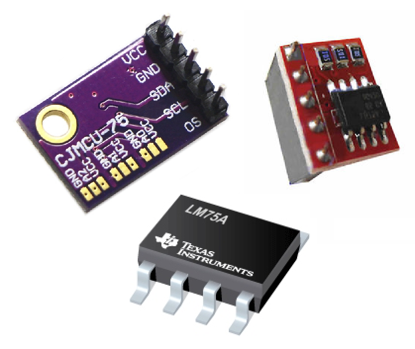
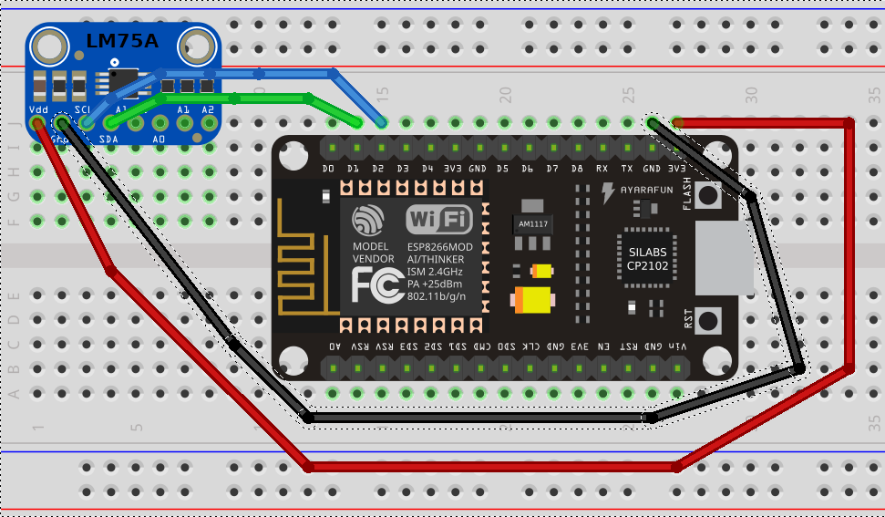

# LM75A Temperature Sensor Library for ESP8266 NodeMcu(arduino-framework)

## What is it?

This library (with example in main.cpp) is designed to be integrated in projects using LM75A sensors to get temperature.

## How to connect the sensor to your ESP8266

LM75A sensor | NodeMcu
-------- | --------
VCC      | 3.3V
GND      | GND
SDA      | D1 (GPIO 5)
SCL      | D2 (GPIO 4)
A0      | GND (or VCC to increase I2C address of 1)
A1      | GND (or VCC to increase I2C address of 2)
A2      | GND (or VCC to increase I2C address of 4)
OS      | None

## Examples

One example is provided with this library:

### Show temperature in degrees and fahrenheit every second

<a target="_blank" href="https://github.com/mec-kon/lm75-esp2866/blob/master/src/main.cpp">Link to source code</a>

## License

This project is under MIT license. This means you can use it as you want (just don't delete the library header).

## Contribute

If you want to add more examples or improve the library, just create a pull request with proper commit message and right wrapping.

